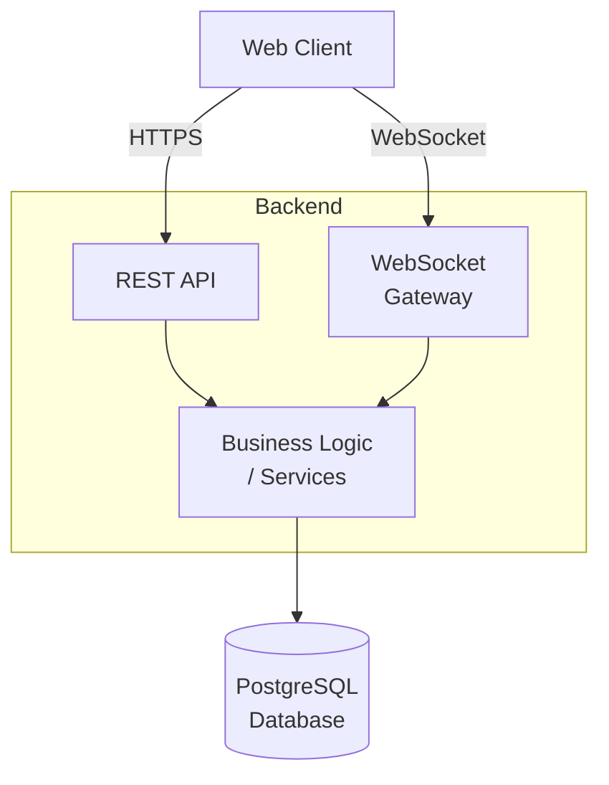

## Architecture

## Entity Relationship

## Application Flow

# Architecture Decision Records
## ADR001 Use websockets for real-time updates
### Context
All users in the board shall see modifications in the board in real-time
### Decision