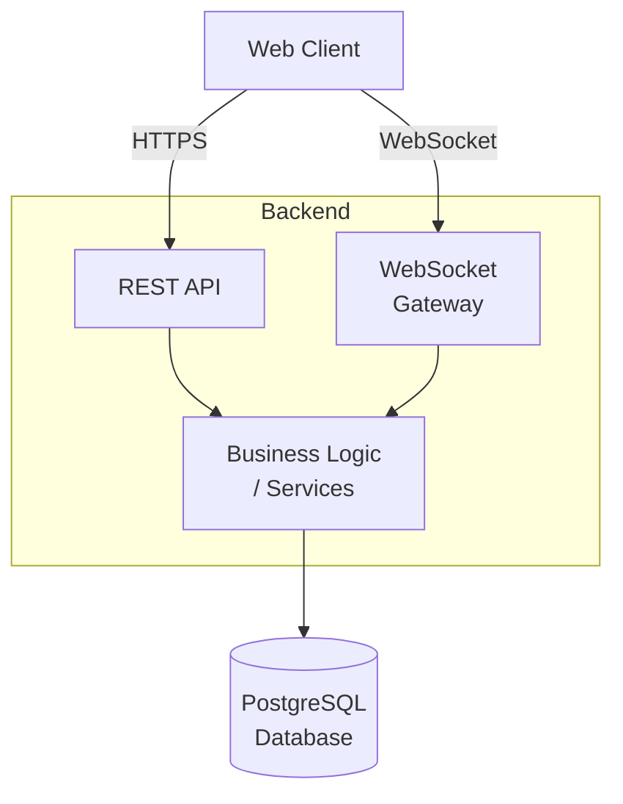
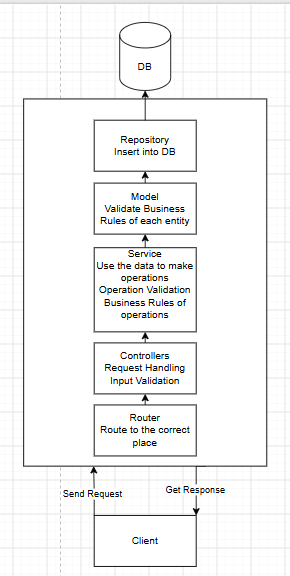

## Architecture

## Entity Relationship

## Application Flow

# Architecture Decision Records

## ADR001 Use WebSockets for Real-Time Updates

### Context

All users viewing a board shall see modifications to the board in real time

### Decision

Use WebSockets to estabilish a two-way connection between the server and clients, alllowing both sides to send and receive data in real time

### Consequences

Modifications will appear in real time to all users connected to the board.However, the system will need to handle WebSockets connections, rooms, reconnections and backpressure

## ADR002 Use Optmistic Concurrency Control

### Context

Multiple users may attempt to modify the same item at the same time, which could lead to data loss or incosistent data

### Decision

Use Optimistic Concurrency Control (OCC). When a client makes a change, it sends the version of the data.The server compares this version with the current version of the data in the database. If the version match, the change is applied and the version is incremented.However if the database version is higher than the client's version, the change is rejected and the client must fetch the updated data from the server before attempting another modification again

### Consequences

Concurrent modifications will not lead to inconsistent data or ovewrite newer changes. However, if a client attempts to modify data with an outdated version, its modification will be rejected and the client will need to retrieve the latest version before trying again

## ADR003 Use Fractional Indexing

### Context

A user may want to change the position of an item by moving it between two other items, this would normally require reordering the items in the column

### Decision

Use Fractional Indexing,where each item is assigned a key instead of an integer position. When an item is moved or inserted between two other items, it receives a newly generated key that places it between the two existing items

### Consequences

When the order of cards in a column changes it is not necessary to recalculate and update the position of every card, only the moved card needs to be updated
