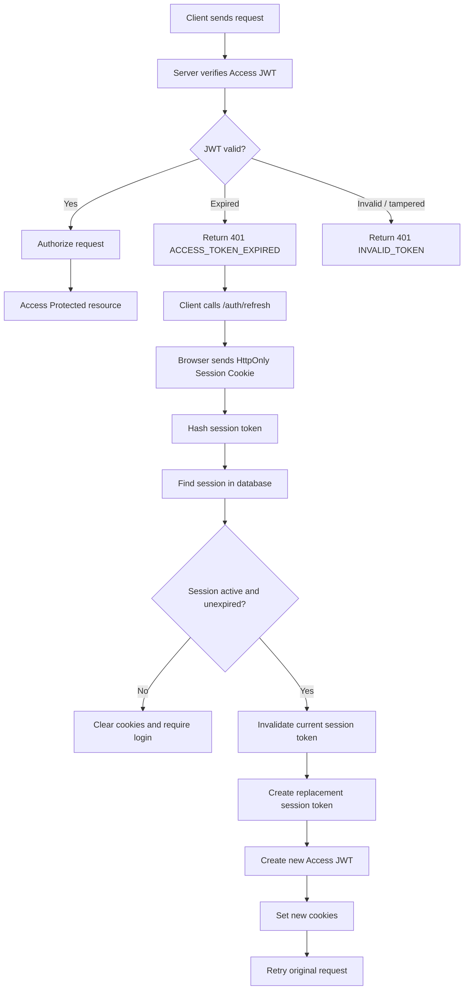

## Authentication and Authorization

## Token and Cookie Configuration

### Access Token

- Lifespan: 30 minutes
- JWT
- Stored in an httpOnly Cookie Secure
- SameSite = Strict

### Session Token

- Lifespan: 7 days
- Session Secret (256 bits of cryptographically secure randomness)
- Database store the hash of the session secret
- Stored in an httpOnly Cookie Secure
- SameSite = Strict
- Hash of the secret stored in the Database

## Protected Routes

Whenever the client attempts to access a protected route, the middleware checks the Access Token first.

1. If the Access Token is valid, the client can access the protected resource or route.
2. If the Access Token is invalid, client sends the Session Token.
3. If the Session Token is valid, the server issues a new Access Token and Rotate the Session Token.
4. If the Session Token is invalid, the client is logged out.
